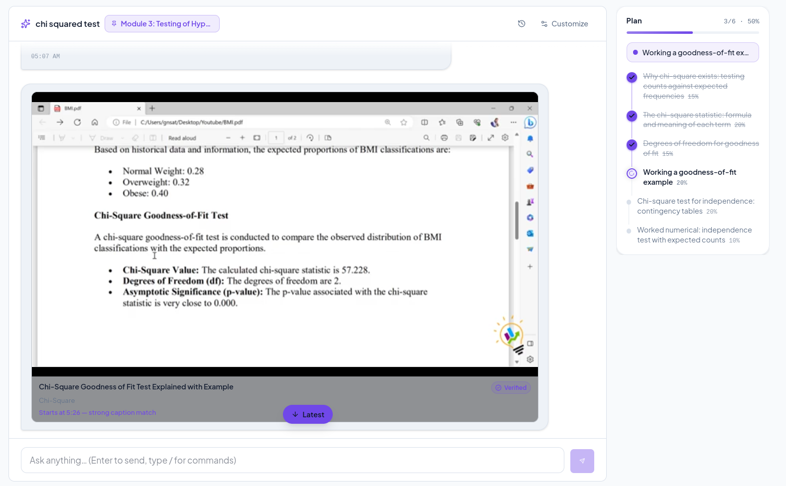
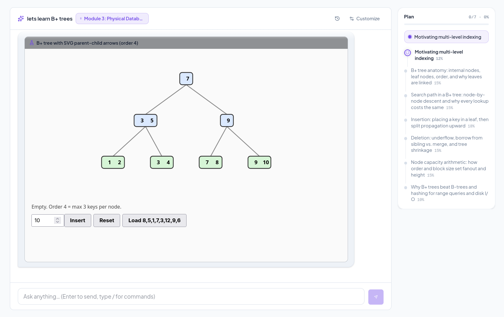

# KnowlegeOS

**A local-first study companion for turning course materials into focused learning.**

Build a library for each course, study with an AI tutor grounded in your own
materials, and keep track of what to review next.

## Features

- **Organized course library** — structure courses into modules and topics;
  upload syllabi, PDFs, slides, and notes; then annotate useful passages.
- **Intelligent material processing** — extract document text, describe useful
  figures, split content into meaningful passages, and make it retrievable by
  topic.
- **Grounded AI tutoring** — stream a conversation with a tutor that retrieves
  relevant course passages, explains concepts, creates diagrams, and retains
  useful learner context.
- **Interactive visualizations and demos** — share images in chat, view
  generated figures and Mermaid diagrams, and launch safe, self-contained
  `show_demo` simulations that make abstract processes easier to explore.
- **In-chat quizzes and grading** — practice with one question at a time,
  receive a tutor-led debrief, and use the results to identify strengths and
  gaps.
- **Spaced review** — turn key ideas into recall cards and schedule follow-up
  reviews with SM-2 repetition based on demonstrated understanding.
- **Adaptive study plans** — track proficiency, weak points, study time,
  deadlines, and active step-by-step learning plans that move at the learner's
  pace.
- **YouTube learning support** — find relevant educational videos without an
  API key, verify them against topic material using available captions, and
  open an embedded player at the most relevant timestamp.
- **Web research when needed** — supplement library material with focused web
  search and page retrieval when a question calls for current or broader
  context.
- **Local-first privacy** — materials, database records, and chat history stay
  on your machine; only content sent to your configured LLM endpoint leaves the
  app.

## Screenshots

| Tutor | Learning library | Quiz practice |
|---|---|---|
|  |  |  |

| YouTube learning | Show Demo visualizations |
|---|---|
|  |  |

## Get started

You will need Python 3.14+, [uv](https://docs.astral.sh/uv/), Node.js 18+, and
an OpenAI-compatible LLM endpoint.

```bash
# Optional: create a local configuration with your model endpoint.
cp config.toml myconfig.toml
# Edit [llm] base_url and model, then:
export KB_CONFIG="$PWD/myconfig.toml"

# Build and start the app.
./run.sh
```

Open <http://localhost:8000> and start by creating a course and adding your
first material.

## Development

```bash
# Backend
uv sync
uv run uvicorn app.main:create_app --factory --reload --port 8000

# Frontend, in a second terminal
cd frontend
npm install
npm run dev
```

Run the checks with `uv run pytest`, `uv run ruff check .`, and
`cd frontend && npm run build`.

## Configuration

The default model settings are in `config.toml`. You can use a separate file
with `KB_CONFIG` or override values directly:

```bash
export KB_LLM_BASE_URL="http://127.0.0.1:9173/v1"
export KB_LLM_MODEL="EXPERT"
```

The tutor requires function-calling support from the configured endpoint.
