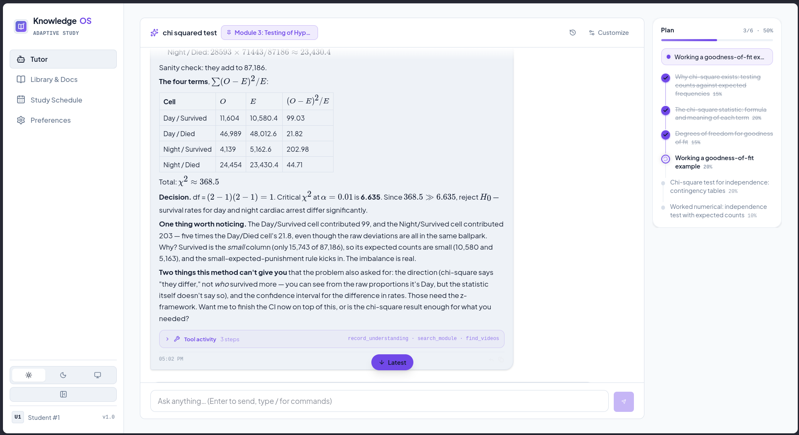
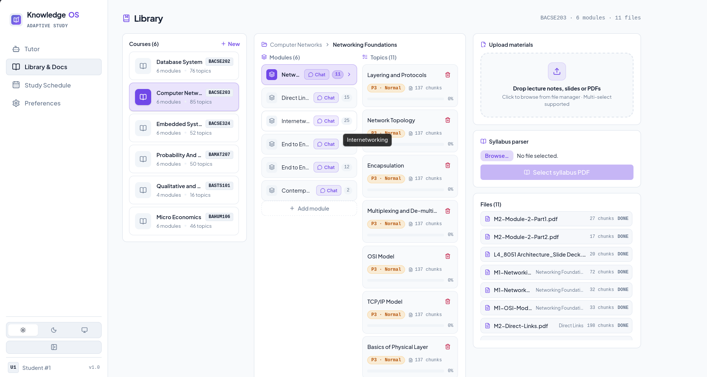
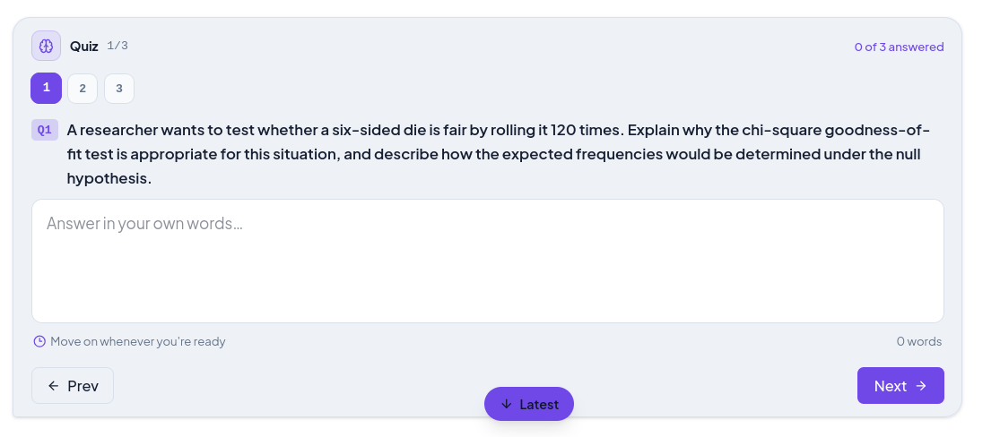

# KnowlegeOS

**A local-first study companion for turning course materials into focused learning.**

Build a library for each course, study with an AI tutor grounded in your own
materials, and keep track of what to review next.

## Features

### Your learning library

Organize every course into modules and topics, then upload notes, slides, PDFs,
and other study materials. Documents are processed in the background and made
available as searchable passages, with room for notes and annotations along the
way.

### AI tutor, grounded in your material

Chat with a tutor that can find relevant passages from your library, explain
concepts, create diagrams, and remember useful context from previous sessions.
It can also search the web when your material needs a little extra context.

### Practice as you study

Ask for a quiz directly in the conversation. Questions appear as simple,
one-at-a-time cards; when you finish, the tutor uses your results to explain
what you understand and what is worth revisiting.

### A plan that adapts

Track proficiency, weak points, review schedules, study time, and deadlines.
KnowlegeOS uses that information to help shape study plans around the areas
that need the most attention.

### Private by default

Your database, uploads, and chat history stay on your machine. Only the content
sent to the LLM endpoint you configure leaves the app.

## Screenshots

| Tutor | Learning library | Quiz practice |
|---|---|---|
|  |  |  |

## Get started

You will need Python 3.14+, [uv](https://docs.astral.sh/uv/), Node.js 18+, and
an OpenAI-compatible LLM endpoint.

```bash
# Optional: create a local configuration with your model endpoint.
cp config.toml myconfig.toml
# Edit [llm] base_url and model, then:
export KB_CONFIG="$PWD/myconfig.toml"

# Build and start the app.
./run.sh
```

Open <http://localhost:8000> and start by creating a course and adding your
first material.

## Development

```bash
# Backend
uv sync
uv run uvicorn app.main:create_app --factory --reload --port 8000

# Frontend, in a second terminal
cd frontend
npm install
npm run dev
```

Run the checks with `uv run pytest`, `uv run ruff check .`, and
`cd frontend && npm run build`.

## Configuration

The default model settings are in `config.toml`. You can use a separate file
with `KB_CONFIG` or override values directly:

```bash
export KB_LLM_BASE_URL="http://127.0.0.1:9173/v1"
export KB_LLM_MODEL="EXPERT"
```

The tutor requires function-calling support from the configured endpoint.
